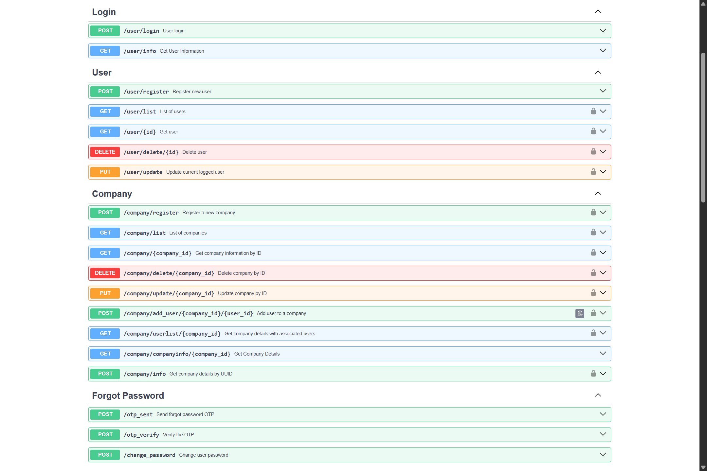

# AuthLink System

AuthLink System is a comprehensive API built with FastAPI that facilitates user and company management functionalities. This project includes endpoints for managing users, companies, and related details, making it a powerful tool for handling various aspects of user and company data within applications.

## Features

### User Management

- **Register New User:**
  - Allows the creation of new user accounts with necessary details such as name, email, and password.
  - Supports additional optional fields such as city, state, country, and profile image.

- **Update User Information:**
  - Enables the modification of user details such as name, email, and role.
  - Allows users to update optional fields including their city, state, country, and profile image.

- **Delete User:**
  - Provides the ability to remove user accounts from the system.
  - Ensures that associated data (if any) is handled appropriately upon user deletion.

- **List Users:**
  - Retrieves a list of all users in the system.
  - Supports filtering and sorting based on query parameters like search string, sort by, and sort direction.

### Company Management

- **Register New Company:**
  - Facilitates the addition of new company records with essential details such as company name, email, and other relevant information.

- **Update Company Information:**
  - Allows modification of company details including name, email, and address.
  - Supports updates to any other company-specific attributes as needed.

- **Delete Company:**
  - Provides functionality to delete a company from the system.
  - Ensures that related data (e.g., associated users) is managed as per business rules.

- **List Companies:**
  - Retrieves a list of all companies.
  - Includes options to filter and sort the results based on query parameters.

- **Add User to Company:**
  - Enables the association of users with a specific company.
  - Handles the addition of users to companies, ensuring that the relationship is properly established.

- **Get Company with Users:**
  - Fetches detailed information about a company along with a list of users associated with that company.
  - Provides a comprehensive view of company-user relationships.

### Authentication

- **User Login:**
  - Allows users to log in to the application using their email and password.
  - Generates a JWT (JSON Web Token) upon successful authentication, which can be used for accessing protected endpoints.

- **JWT Authentication:**
  - Protects routes and resources by requiring a valid JWT token in the authorization header.
  - Ensures secure access to protected endpoints based on user roles and permissions.

### Forgot Password

- **Send Forgot Password OTP:**
  - Initiates the process for password recovery by sending a one-time password (OTP) to the user's email.
  - Allows users to request OTP for resetting their password.

- **Verify OTP:**
  - Validates the OTP received by the user.
  - Ensures that the OTP is correct and within the validity period before allowing password reset.

- **Change Password:**
  - Provides functionality for users to reset their password using the verified OTP.
  - Allows users to set a new password and securely update their account credentials.

### Background Tasks

- **Email Sending:**
  - Handles background tasks such as sending emails for various purposes (e.g., registration confirmation, password recovery).
  - Ensures that email-related operations are performed asynchronously to improve application performance.


## Setup

### Prerequisites

- Python 3.8 or later
- MySQL or compatible database
- Environment variables for email and JWT secret key


### Installation

1. **Clone the repository:**

    ```bash
    git clone https://github.com/LaxmiNarayana31/authlink-system.git
    cd user-company-management-api
    ```

2. **Create a virtual environment and activate it:**

    ```bash
    pip install pipenv
    pipenv shell
    ```

3. **Install the dependencies:**

    ```bash
    pipenv install
    ```

4. **Set up the environment variables:**

    Create a `.env` file in the root directory and add the required variables listed in `.env.sample` file.


5. **Run the application:**

    ```bash
     pipenv run main
    ```

    The application will be available at `http://127.0.0.1:8000/docs#/`.


## API Endpoints

### User Endpoints

- **Register New User:** `POST /user/register`
  
- **Get All Users:** `GET /user/list`

- **Get User by ID:** `GET /user/{id}`

- **Delete User by ID:** `DELETE /user/delete/{id}`

- **Update Current Logged User:** `PUT /user/update`

### Login Endpoints

- **User Login:** `POST /user/login`

- **Get User Information by Token:** `GET /user/info`

### Company Endpoints

- **Register a New Company:** `POST /company/register`

- **Get All Companies:** `GET /company/list`

- **Get Company by ID:** `GET /company/{company_id}`

- **Delete Company by ID:** `DELETE /company/delete/{company_id}`
- **Update Company by ID:** `PUT /company/update/{company_id}`

- **Add User to Company:** `POST /company/add_user/{company_id}/{user_id}`

- **Get Company with Users:** `GET /company/userlist/{company_id}`

- **Get Company Details by UUID:** `POST /company/info`

- **Get Created and Updated Time of Company:** `GET /companyinfo/{company_id}`

### Forgot Password Endpoints

- **Send Forgot Password OTP:** `POST /forgot_password/otp_sent`

- **Verify OTP:** `POST /forgot_password/otp_verify`

- **Change Password:** `POST /forgot_password/change_password`




Feel free to adjust any sections to better fit your project’s specifics or any additional details you want to include.
